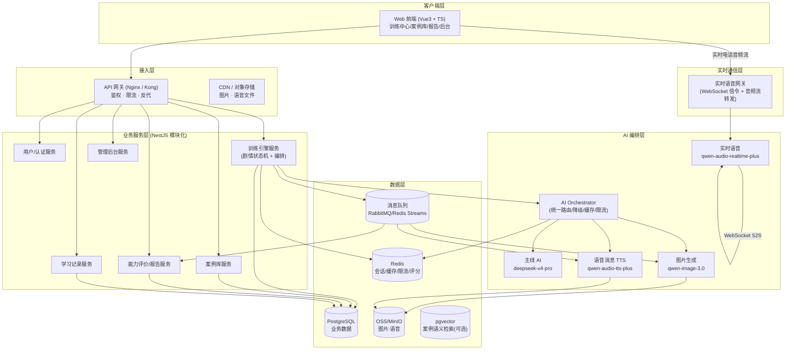
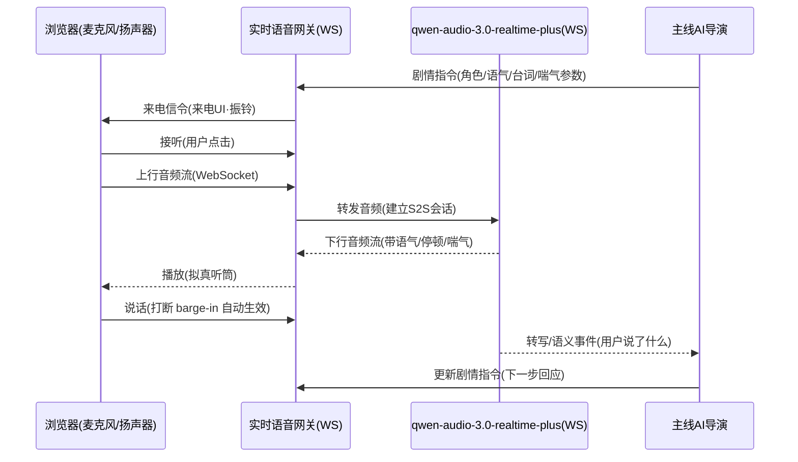

# 「警心护航」沉浸式反诈科普平台 — 技术方案

> 项目定位：面向警校生 + 公安实际需求的人工智能（AI+）教育赋能平台
> 核心闭环：**沉浸式情景训练 → 主线 AI 动态编排剧情 → 多模态拟真交互（文本/图片/语音/实时电话）→ 维度化能力评价 → 案例库/能力报告/学习记录 → 管理后台**
> 版本：v1.0（技术架构 + 模块细化 + 差异化分析）

---

## 0. 需求理解与设计目标

### 0.1 平台要解决的三个核心问题

1. **教学问题**：传统反诈宣传是"单向告知"（海报、短视频、讲座），记忆留存低、无法形成"行为级"防骗能力。平台把用户放进**高度拟真的诈骗情境**里"做中学"。
2. **实训问题**：警校缺乏低成本、可重复、可量化的反诈实训工具。平台用 AI 扮演"骗子/受害者家属/客服"，提供无限次、零风险、可打分的对抗训练。
3. **数据问题**：公安反诈需要了解"群众容易在哪里被骗、什么话术最有效"。平台的训练行为数据可沉淀为**易受害画像与高发套路洞察**，反哺实战宣防。

### 0.2 关键设计约束（源自 Design 描述）

| 约束 | 设计响应 |
|---|---|
| 实时语音通话（AI 主动呼入 + 用户主动呼入） | 实时语音网关 + 语音转语音（S2S）模型 |
| 多模态交互（文本/图片/语音消息/模拟电话） | 主线 AI 作为"导演"统一编排多模态消息时序 |
| 高并发训练 | 无状态服务 + Redis 会话 + 消息队列异步化 |
| 多供应商/多 API Key 统一管理 | AI Provider 抽象层 + 密钥保险库 + 后台管理 |
| 现代美观 UI + 流畅动效 | 前端组件化 + 动效库 + 骨架屏/流式渲染 |
| 用户注册信息（用户名/密码/学校/学历）+ 后台可管 | 用户中心 + RBAC 后台 |

---

## 1. 技术架构规划

### 1.1 AI 选型核实与修正建议

> Design 描述给出的四个模型经核实**均真实存在、且方向正确**。落地建议：接入渠道统一走官方（阿里云千问 AI / 百炼），并为主线 AI 配置降级通道。

| 角色 | 设计选型 | 核实结论 | 修正建议 |
|---|---|---|---|
| 主线 AI（剧情编排/报告） | `deepseek-v4-pro`（DeepSeek 官方 API） | ✅ 真实可用（OpenAI 兼容 `/chat/completions`，[DeepSeek API 文档](https://api-docs.deepseek.com/)）。推理与结构化输出能力强，适合做"导演" | 官方 API（`api.deepseek.com`），模型名 `deepseek-v4-pro`（OpenRouter 上的 `deepseek-v4-pro-0813` 对应官方 `deepseek-v4-pro`）；失败时回退规则剧本 |
| 图片生成 | `qwen-image-3.0-pro` | ✅ 真实（阿里云千问/百炼 [Qwen-Image-3.0 API](https://www.alibabacloud.com/help/en/model-studio/qwen-image-generation-and-editing-api-reference)） | 设计文档给的 `qianwenai.com` 为阿里云千问官方站点（已核实）；统一走阿里云官方（千问 AI / 百炼）以保障 SLA、安全与合规 |
| 语音消息 TTS | `qwen-audio-3.0-tts-plus` | ✅ 真实（[百炼官方文档](https://help.aliyun.com/zh/model-studio/qwen-audio-3-0-tts-plus.md)） | 同上走官方百炼；非实时语音可用更低的 `qwen3-tts-flash` 降本 |
| 实时语音（虚拟电话） | `qwen-audio-3.0-realtime-plus` | ✅ 真实（[百炼官方文档](https://help.aliyun.com/zh/model-studio/qwen-audio-3-0-realtime-plus)），基于 WebSocket 的语音转语音，支持打断/语气/韵律 | 同上走官方百炼；这是**语音转语音（S2S）模型**，不是纯 TTS，架构上要按"双向音频流"设计（见 1.4） |

**结论**：四个模型的**选型组合是合理的**（推理 + 图像 + 异步 TTS + 实时 S2S 的分工清晰、能力互补）。接入渠道统一走官方：主线 AI 用 DeepSeek 官方 API（`api.deepseek.com`），图像/语音/实时语音用阿里云千问（`qianwenai.com` / 百炼）。

### 1.2 总体架构（分层 + 模块化单体起步）



**架构决策说明**：

1. **模块化单体起步，预留微服务拆分边界**。MVP 用 NestJS 单进程内模块隔离（Auth/Train/Case/Report/Record/Admin），各模块独立目录、独立数据边界；高并发瓶颈出现后，仅把"训练引擎 + 实时语音网关"拆成独立服务水平扩展即可，其余模块无痛迁出。
2. **AI 编排层独立**：所有模型调用收口到 Orchestrator，业务层不直接面对供应商 SDK，这是"后台统一管理多供应商/多 Key"需求的技术落点。
3. **实时语音网关独立**：长连接与 REST 业务分离，避免音频流阻塞业务 API，也便于独立扩缩容与连接数治理。

### 1.3 技术选型清单

| 层 | 选型 | 理由 |
|---|---|---|
| 前端 | Vue 3 + TypeScript + Vite + Pinia + TailwindCSS + Naive UI | 现代 UI、生态成熟、中文社区好；Vite 秒级热更 |
| 前端动效 | VueUse Motion / GSAP + ECharts | 流畅转场、图表（折线/雷达/趋势） |
| 后端 | NestJS（Node.js + TypeScript） | 前后端同语言；强 WebSocket/流式支持；模块化 + DI 适合 AI 编排 |
| 实时语音网关 | NestJS（或 Go）独立服务 | 长连接、音频流转发、背压控制 |
| 主数据库 | PostgreSQL 15+ | JSONB 存剧本/对话、事务、扩展 pgvector |
| 缓存/会话 | Redis 7 | 剧情会话状态、分布式锁、限流、实时评分 |
| 对象存储 | 阿里云 OSS / MinIO | 图片与语音文件、CDN 加速 |
| 消息队列 | RabbitMQ（或 Redis Streams） | 图片生成/报告生成异步化、削峰 |
| 部署 | Docker + Docker Compose（MVP）→ K8s（生产） | 可复制、可弹性 |
| 可观测 | Prometheus + Grafana + Loki + OpenTelemetry | 指标/日志/链路追踪 |

### 1.4 实时语音通话架构（虚拟电话）

> "虚拟电话"在本平台内是**应用内的拟真来电**（用户看到来电界面、接听、通话），不是真实 PSTN 公共电话网。若后续要打真实手机，可扩展接入阿里云智能联络中心（见 1.5 扩展）。

`qwen-audio-3.0-realtime-plus` 是**语音转语音（S2S）**模型，输入/输出都是音频流，天然支持打断。架构采用"**双 WebSocket 桥接**"：



**关键工程点**：

1. **音频格式统一**：浏览器采集 PCM 16k/16bit 单声道 → 网关转封装为模型要求的帧格式；下行同理。
2. **低延迟**：音频不做落地存储、直接透传；网关只做协议转换 + 鉴权 + 计费埋点，控制在 < 300ms。
3. **打断（barge-in）**：模型侧 S2S 已支持，网关用 VAD（静音检测）或用户输入能量触发上行抢占，实现真实通话的"随时插话"。
4. **拟真细节**：语气、间隔、停顿、喘气由**导演在每次 `session.update` 指令里携带参数**（如 `{tone:"急促", pause_ms:400, breath:"重"}`），模型据此渲染。
5. **两种呼入路径**：
   - **AI 主动来电**：导演判定剧情时机 → 网关下发"来电"信令 → 用户接听。
   - **用户主动拨打**：用户在情境中选择"回拨" → 网关主动建连 → 导演接管对话。
6. **断线重连与降级**：弱网下自动降采样；S2S 不可用时降级为"异步 TTS 消息 + 用户文本回复"，保证剧情不中断。

### 1.5 高并发训练场景设计

1. **无状态 + 水平扩展**：业务 API 无状态，会话/剧情状态全部放 Redis（`training:{sessionId}`），任意实例可接管，天然支持 K8s HPA 弹性扩缩容。
2. **长连接独立治理**：实时语音网关按连接数独立扩缩容，连接数、吞吐、P95 延迟单独监控。
3. **慢任务异步化**：图片生成、语音合成、能力报告生成都是秒级~十秒级任务，统一投递消息队列，由 Worker 池消费，避免阻塞主线对话。
4. **限流 / 熔断 / 降级**：
   - 网关层令牌桶限流（防刷）。
   - Orchestrator 对每个供应商做熔断（失败率阈值 → 熔断 → 半开探测）。
   - **主线 AI 降级链**：`deepseek-v4-pro（DeepSeek 官方）` → `规则剧本兜底`（剧本 DSL 内置的固定分支话术），保证训练永不中断。
   - 图片生成降级：模型失败 → 缓存命中同 prompt 历史图 → 占位图。
5. **缓存策略**：相同 prompt 的图片、相同台词的 TTS 做结果缓存（Redis + OSS），命中即复用，显著降低模型成本与延迟。
6. **数据库**：读写分离 + 连接池；热点查询（案例列表、报告汇总）走 Redis 缓存。
7. **成本控制**：主线 AI 用"短对话 + 结构化输出"控制 token；TTS 用 flash 版；图片按需生成 + 缓存。

### 1.6 扩展点（可选，不进 MVP）

- **真实 PSTN 电话**：接入阿里云智能联络中心/隐私号，AI 打真实手机（需实名、合规、计费评估）。
- **语音克隆**：用受害人/亲属声音复刻增强拟真（需明确授权与合规边界，仅用于教育科普）。

---

## 2. 功能模块细化（技术实现路径）

### 2.1 训练中心

**页面结构**：推荐情景 / 情景列表（状态：未练过、失败重来、复习；预计通关时间/难度）/ 本周能力（身份核验、资金安全、隐私保护、应急处置四维分数）。

**实现路径**：

- **推荐情景**：规则（新用户推入门）+ 协同/内容过滤（按四维短板推荐薄弱项对应情景）。MVP 用"短板优先"规则即可。
- **情景列表状态机**：`未练过 → 通关 → 复习(冷却后)/失败重来`，状态由训练结果流水驱动，Redis 缓存 + DB 落库。
- **四维分数**：读能力评价服务最新一次的四维分（见 2.4），前端卡片 + 迷你雷达图。

**数据表**：`scenario`、`user_scenario_status`。

### 2.2 情景训练引擎（平台技术核心）

这是全平台技术含量最高的模块，采用 **「剧本骨架 + AI 导演」混合编排**：

#### 2.2.1 剧本 DSL（护栏，保证可控可复现）

每个情景用 JSON 定义"骨架"，包含：角色（`characters`）、结局集合（`endings`）、关键判定点（`triggers`，如 `transfer`转账 / `share_screen`屏幕共享 / `report`报警 / `block`拉黑）、开场消息、道具（图片/语音模板）。示例：

```jsonc
{
  "id": "scn_001",
  "title": "“妈妈”遭遇车祸，急需垫付医药费",
  "fraud_type": "冒充亲友求助",
  "difficulty": 2,
  "roles": [
    { "key": "mom", "name": "妈妈", "persona": "语气焦急、略带哭腔", "voice": "qwen_tts_middle_female" },
    { "key": "doctor", "name": "急救医生", "persona": "冷静、催促交费" }
  ],
  "triggers": {
    "transfer": { "type": "outcome", "ending": "victim" },
    "verify":   { "type": "score", "dimension": "identity_check", "delta": 40 },
    "report":   { "type": "outcome", "ending": "defended" },
    "block":     { "type": "outcome", "ending": "defended" }
  },
  "opening": { "channel": "text", "role": "mom", "content": "孩子，妈出车祸了，医院要交押金…" }
}
```

#### 2.2.2 主线 AI 导演（动态编排）

导演的核心职责是：**根据用户反应，决定"下一步发什么、用什么通道、什么语气"**。通过**结构化输出（JSON Schema / Function Calling）**把剧情决策机器可读化：

```jsonc
// 导演每轮输出（Function Call 参数）
{
  "next_action": "voice_call",          // text | image | voice_msg | voice_call | ending
  "speaker": "mom",
  "content": "孩子，你先把钱打过来，妈这边等不起啊…",
  "voice_params": { "tone": "crying_urgent", "pause_ms": 350, "breath": "heavy" },
  "image_prompt": null,
  "score_deltas": { "fund_safety": -15 },   // 若用户已倾向转账
  "evaluate_flags": ["hesitation", "no_verify"]
}
```

**关键设计**：
1. **导演只做决策，不做内容越界**：所有输出必须落在剧本 DSL 允许的角色/通道/结局内，形成"护栏"。这保证：剧情不跑偏、可复现、安全可控（不会真的教用户新骗术细节）。
2. **上下文**：`system prompt = 剧本骨架 + 角色人设 + 教育目标`；`history = 压缩后的对话 + 用户能力画像`。
3. **判定用户关键行为**：用户点"转账/提供身份证/开屏幕共享" → 立即触发 `transfer` 结局；"报警/拉黑/核实身份" → 触发防御结局或加分。
4. **全链路事件驱动**：导演决策 → 事件总线 → 各执行器（文本消息服务 / 图片生成 / 语音消息 TTS / 实时电话网关 / 评分采集器）。

#### 2.2.3 多模态消息时序

- **文本**：直接下发（流式 SSE 输出，打字机效果）。
- **图片**：异步生成 → OSS → 前端懒加载占位 → 到图即替换（失败走占位图）。
- **语音消息**：异步 TTS → OSS → 播放条。
- **模拟电话**：见 1.4 实时语音。

#### 2.2.4 结局与复盘

- 结局集合（被骗 / 成功识破 / 报警 / 拉黑）+ 解锁机制（案例库展示"解锁的结局"）。
- 触发结局 → 进入"赛后复盘"：回放关键决策点 + 逐点点评（导演生成）+ 四维分变更。

**数据表**：`training_session`、`training_message`、`training_event`、`scenario_ending`。

### 2.3 案例库

**页面**：所有情景陈列（自己历史分数、解锁结局、诈骗类型、难度）；点击进详情（统计数据、折线图、诈骗类型）；可从案例库直接开训。

**实现路径**：

- 案例 = 情景模板 + 该用户的成绩聚合视图（`user_scenario_status` 多表联查）。
- **折线图**：按时间维度取该用户对该情景的历次分数，ECharts 折线。
- **诈骗类型标签**：`冒充亲友求助 / 冒充客服退款 / 兼职刷单`，支持扩展，落在 `scenario.fraud_type`。
- **解锁结局**：`user_scenario_status.unlocked_endings`（JSONB 数组）。
- （可选进阶）`pgvector` 语义检索：按自然语言"我想练练冒充客服的"检索案例。

### 2.4 能力评价 / 能力报告

**四维能力模型**：`身份核验`、`资金安全`、`隐私保护`、`应急处置`，每个维度 0–100。

**评分机制（规则 + AI 双引擎，保证稳定与可解释）**：

1. **规则引擎（兜底，确定性强）**：在剧本 DSL 的 `triggers` 里声明行为→分数映射（如"核实身份 +40"），训练过程中实时累加。这是**分数的硬基础**，可解释、可复现。
2. **主线 AI（增强，语义理解）**：对用户的**自由文本回复**做语义判定（是否有核实意识、是否慌乱、是否轻信），输出 `score_deltas` 与评语。
3. **融合**：规则分 + AI 语义分加权 → 四维分 → 落库。

**报告页**：战绩（通关数/成功率/总时长）、能力段位、四维雷达图、能力趋势折线图。段位由四维加权分映射（如青铜→白银→黄金→王者）。

**数据表**：`ability_score`（每次训练四维分）、`ability_report`（汇总快照）。

### 2.5 学习记录

- 每次训练一条流水：时间、情景、结局、四维分、用时、关键行为。
- 点击跳转案例库对应案例的能力详情（携带 `scenario_id` 路由参数）。
- 分页 + 筛选（时间/情景/结局）。

**数据表**：`training_session`（即流水主表）+ 索引。

### 2.6 管理后台

| 子功能 | 技术实现 |
|---|---|
| **AI 供应商/API Key 管理** | `ai_provider` 表存供应商类型、base_url、模型列表；`ai_credential` 存密钥（**AES-256 加密落库 / KMS 注入，界面只显示掩码**）；提供"连通性测试"按钮（发一次最小请求）；支持启用/停用、主备切换 |
| **用户管理** | 用户列表（用户名/学校/学历/角色/状态）、重置密码（BCrypt 哈希 + 强制改密标记）、角色权限（RBAC：学生/教师/管理员） |
| **数据库管理** | 生产走 pgAdmin/DMS；后台提供基础运维视图（表容量、慢查询、备份状态展示），不直接开放危险操作 |
| **训练情景 CRUD** | 剧本编辑器：表单 + JSON 编辑器（带 Schema 校验 + 语法高亮）+ **版本管理（草稿/发布/下线）**；支持新增情景（满足"后续可添加"） |
| 审计 | 所有后台敏感操作写审计日志（谁在何时改了什么） |

### 2.7 核心数据模型（ER 摘要）

```
user (id, username, password_hash, school, education, role, status, created_at)
scenario (id, title, fraud_type, difficulty, est_time, script_json, status, version)
user_scenario_status (user_id, scenario_id, best_score, attempts, status, unlocked_endings)
training_session (id, user_id, scenario_id, status, ending, scores_json, duration, started_at, ended_at)
training_message (id, session_id, seq, channel, role, content, asset_url, meta_json)
training_event (id, session_id, type, payload_json, ts)          -- 关键行为/评分事件
ability_score (id, session_id, user_id, identity, fund, privacy, response)
ability_report (user_id, period, scores_json, tier, updated_at)
ai_provider (id, name, type, base_url, models_json, enabled)
ai_credential (id, provider_id, key_cipher, mask, enabled)
audit_log (id, operator_id, action, target, detail_json, ts)
```

---

## 3. 差异化亮点提炼

### 3.1 与现有反诈产品的对比

| 产品/形态 | 模式 | 局限 |
|---|---|---|
| 国家反诈中心 APP | 预警拦截、案例推送、风险查询 | 偏"被动告知/阻断"，无行为训练 |
| 运营商/银行反诈 | 拦截、短信提醒 | 单点防御，事后补救 |
| 反诈宣传（短视频/H5/讲座） | 单向传播 | 记忆留存低，无能力评估 |
| 少数"反诈模拟"小程序 | 静态选择分支 | 无实时语音、无多模态、无 AI 动态剧情、无能力画像 |

### 3.2 本平台的差异化价值

**① 从"被动宣传"到"主动行为训练"（模式创新）**
把反诈从"知识告知"升级为"沉浸式做中学"。用户在拟真情境里**亲手操作**（转账、核实、报警、拉黑），形成肌肉记忆级的行为防骗能力，并用四维分数量化"会不会被骗"。

**② AI 动态导演 + 全模态拟真（体验创新）**
主线 AI 随用户反应**动态生成剧情**，而非固定分支；文本、图片、语音消息、实时电话四通道联动；实时电话的**语气、停顿、喘气**等细节高度还原真实诈骗压迫感。这是现有反诈模拟类产品没有的"拟真密度"。

**③ 警校教育场景深度耦合（场景创新，核心壁垒）**
四维能力模型（身份核验/资金安全/隐私保护/应急处置）**对齐警务实训标准**；案例库既是学生题库也是教学素材；能力报告可纳入课程考核。平台天然对接公安院校教学与公安实战培训，是"警校生身份 + 公安实际需求"的直接落点。

**④ "人工智能+" 的技术融合价值（技术创新）**
自研 **AI 编排层（多供应商抽象 + 密钥保险库 + 路由/降级/熔断）**，实现多模型可插拔、可降级、成本可控、可持续升级——这不只是"调用一个 AI"，而是把 AI 作为可治理的基础设施，体现技术工程能力。

**⑤ 数据价值沉淀，反哺公安实战（战略价值）**
训练行为数据可聚合为**"易受害人群画像"**（什么学历/年龄段在什么套路下最容易转账）与**"高发诈骗话术洞察"**（哪些话术命中率最高），反哺公安精准宣防与实战研判。平台从"教学工具"升级为"反诈情报的仿真试验场"。

---

## 4. 非功能性需求与合规

1. **安全**：传输 TLS、密码 BCrypt、API Key 加密、防 SQL 注入/XSS/CSRF、接口鉴权（JWT + RBAC）、操作审计。
2. **AI 安全**：用户输入与系统提示词隔离（防提示注入）；主线 AI 输出约束在剧本护栏内（不扩散新骗术手法）；**生成图片/文本接内容审核**（阿里云内容安全）。
3. **合规**：个人信息保护法（最小化采集、可删除）、数据安全法、等保 2.0（建议按三级设计）、《生成式人工智能服务管理暂行办法》（对生成内容做标识/水印，明确"仅用于反诈教育科普"）。
4. **可观测**：链路追踪（OpenTelemetry）、指标（Prometheus）、日志（Loki）、模型调用计费与延迟埋点。
5. **可用性**：模型降级链保证"训练永不中断"、断线重连、优雅降级。

---

## 5. 开发路线图

| 阶段 | 交付内容 |
|---|---|
| **P1 MVP** | 3 个情景（车祸/客服退款/兼职刷单）、文本+图片+语音消息、主线 AI 编排、规则评分、案例库/报告/记录、后台（用户/供应商/情景 CRUD）、注册登录 |
| **P2 核心增强** | 实时语音虚拟电话（S2S + 网关）、AI 语义评分、段位系统、剧本可视化编辑器 + 版本管理、降级链 |
| **P3 规模化** | K8s 弹性、pgvector 语义检索、（可选）PSTN 真实电话、数据洞察看板、等保测评与内容安全接入 |

---

## 6. 风险与应对

| 风险 | 应对 |
|---|---|
| 模型延迟/成本 | 缓存、flash 版模型、结构化短输出、降级链 |
| 剧情安全（AI 越界教骗术） | 剧本 DSL 护栏 + 输出校验 + 内容审核 |
| 实时语音弱网卡顿 | 降采样、降级为异步 TTS、断线重连 |
| 数据合规 | 最小化采集、加密、审计、明确教育用途 |
| 供应商稳定性 | 多供应商/多通道降级 + 熔断 + 密钥可切换 |

---

*方案覆盖：技术架构（1）、功能模块（2）、差异化亮点（3），并附非功能/路线图/风险。可直接作为开发立项与迭代依据。*
